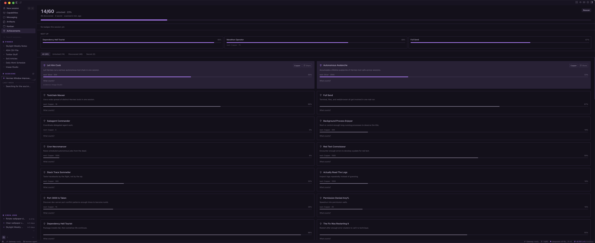

# Hermes Achievements Desktop

Achievements, right inside the Hermes desktop app, with unlock notifications.

An enhanced fork of [asimons81/hermes-desktop-achievements](https://github.com/asimons81/hermes-desktop-achievements), backed by the `hermes-achievements` dashboard plugin that ships with Hermes Agent.



## Features

- **Unlock notifications** — toast, haptic, a chime, and a confetti burst in your theme colors plus the badge's tier color, no page visit required
- **Score header** — unlocked/total, discovered/secret counts, scan freshness, one-click **Rescan**
- **Next up strip** — the locked achievements closest to unlocking, with progress bars and next-tier thresholds
- **Per-session context** — badges earned in the active session, right on the page
- **Share cards** — 1200×630 canvas PNG export for any unlocked badge, ready to post
- **Filter tabs** — all / unlocked / discovered / secret with live counts
- **Statusbar chip** — live score in the bottom-right; click to open
- **Command palette** — ⌘K → "Achievements: Open"

## Install

1. **Backend (required):** the Hermes Agent install already ships `plugins/hermes-achievements/`, which mounts `/api/plugins/hermes-achievements/` on `hermes serve`. Verify it mounted:

   ```bash
   grep "Mounted plugin API routes: /api/plugins/hermes-achievements" ~/.hermes/logs/agent.log
   ```

2. **Desktop plugin:** copy the folder into your desktop plugins directory:

   ```bash
   mkdir -p ~/.hermes/desktop-plugins/hermes-achievements
   cp plugin.js ~/.hermes/desktop-plugins/hermes-achievements/
   ```

3. The app watches that directory, the plugin loads within a few seconds. If it doesn't appear: ⌘K → **Reload desktop plugins**.

## Requirements

- Hermes Agent desktop app (v0.19+ recommended)
- The `hermes-achievements` plugin enabled (bundled with Hermes Agent)

## How it works

- **Zero new backend.** The plugin talks to the existing `hermes-achievements` dashboard plugin API over `ctx.rest` → `/api/plugins/hermes-achievements/achievements`, the same scan engine the web dashboard uses
- **Unlock watcher.** Polls `/achievements` every 15 seconds and diffs against a known-unlock set persisted in plugin storage. First load seeds the baseline, so restarts never replay old unlocks. New unlocks fire a success toast, haptic, and a two-tone chime, then invalidate the shared React Query cache
- **Theme-native.** Cards, chips, and the share card use the app's theme CSS variables, no hardcoded colors, follows light/dark

## Files

```text
plugin.js   The whole plugin — plain ESM, loaded uncompiled (jsx() calls, no JSX syntax)
```

## Development

The desktop plugin SDK docs live in the Hermes Agent repo: `website/docs/developer-guide/desktop-plugin-sdk.md`.

Quick iteration loop: edit `plugin.js`, save, the app hot-reloads in place.

## License

MIT. Fork of the MIT-licensed [hermes-desktop-achievements](https://github.com/asimons81/hermes-desktop-achievements) by [Tony Simons](https://x.com/tonysimons_), extended with unlock notifications, next-up tracking, per-session badges, and share cards by Cliff Wade.
